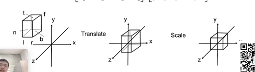
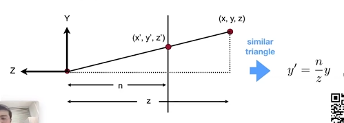

# 坐标变换

## 二维

### Scale

$$S_{(s_x,s_y)} = \begin{bmatrix} s_x&0&0\\\ 0&s_y&0\\\ 0&0&1 \end{bmatrix}$$

### Rotation

$$R_{(\alpha)} = \begin{bmatrix} \cos\alpha&-\sin\alpha&0\\\ \sin\alpha&\cos\alpha&0\\\ 0&0&1 \end{bmatrix}$$

### Translation

$$T_{(t_x,t_y)} = \begin{bmatrix} 1&0&t_x\\\ 0&1&t_y\\\ 0&0&1 \end{bmatrix}$$

## 三维

### Rotation

$$R_{x(\alpha)} = \begin{bmatrix} 1&0&0&0\\\ 0&\cos\alpha&-\sin\alpha&0\\\ 0&\sin\alpha&\cos\alpha&0\\\ 0&0&0&1 \end{bmatrix}$$

$$R_{y(\alpha)} = \begin{bmatrix} \cos\alpha&0&\sin\alpha&0\\\ 0&1&0&0\\\ -\sin\alpha&0&\cos\alpha&0\\\ 0&0&0&1 \end{bmatrix}$$

$$R_{z(\alpha)} = \begin{bmatrix} \cos\alpha&-\sin\alpha&0&0\\\ \sin\alpha&\cos\alpha&0&0\\\ 0&0&1&0\\\ 0&0&0&1 \end{bmatrix}$$

## 投影变换

### 正交投影

$$M_{persp->ortho}^{(4 \times 4)} = \begin{bmatrix} \frac{2}{r - l}&0&0&0\\\ 0&\frac{2}{t - b}&0&0\\\ 0&0&\frac{2}{n - f}&0\\\ 0&0&1&0 \end{bmatrix}\begin{bmatrix} 1&0&0&-\frac{r + l}{2}\\\ 0&1&0&-\frac{t + b}{2}\\\ 0&0&1&-\frac{n + f}{2}\\\ 0&0&0&1 \end{bmatrix}$$

### 透视投影

摄像机朝 Z 轴的负方向看
n 为近平面的距离
f 为远平面的距离

远平面变化

$$ \begin{bmatrix} x\\\ y\\\ z\\\ 1 \end{bmatrix}=>\begin{bmatrix} \frac{n}{f}x\\\ \frac{n}{f}y\\\ unknown\\\ 1 \end{bmatrix} == \begin{bmatrix} nx\\\ ny\\\ unknown\\\ f \end{bmatrix}$$

$$M_{persp->ortho}^{(4 \times 4)} \begin{bmatrix} x\\\ y\\\ z\\\ 1 \end{bmatrix}= \begin{bmatrix} nx\\\ ny\\\ unknown\\\ f \end{bmatrix}$$

$$ z = -n $$

$$ z = -f $$

$$M_{persp->ortho}^{(4 \times 4)} = \begin{bmatrix} n&0&0&0\\\ 0&n&0&0\\\ ?&?&?&?\\\ 0&0&-1&0 \end{bmatrix}$$

近平面

$$ \begin{bmatrix} x\\\ y\\\ z\\\ 1 \end{bmatrix}=>\begin{bmatrix} x\\\ y\\\ z\\\ 1 \end{bmatrix} == \begin{bmatrix} nx\\\ ny\\\ nz\\\ n \end{bmatrix}$$

$$ \begin{bmatrix} 0&0&A&B \end{bmatrix} \begin{bmatrix} x\\\ y\\\ z\\\ 1 \end{bmatrix} = nz $$

$$ => Az + B = nz $$

去z，因为z为负

$$ => A(-n) + B = n(-n) $$

远平面中心点不变

$$ \begin{bmatrix} 0\\\ 0\\\ z\\\ 1 \end{bmatrix}=>\begin{bmatrix} 0\\\ 0\\\ z\\\ 1 \end{bmatrix} == \begin{bmatrix} 0\\\ 0\\\ fz\\\ f \end{bmatrix}$$

$$ => Az + B = fz $$

去z，因为z为负

$$ => A(-f) + B = f(-f) $$

解得

$$  A = n + f $$

$$  B = nf $$

$$M_{persp->ortho} = \begin{bmatrix} n&0&0&0\\\ 0&n&0&0\\\ 0&0&n+f&nf\\\ 0&0&-1&0 \end{bmatrix}$$

$$M_{persp} = M_{ortho}M_{persp->ortho}$$

## 视口变换

转化到屏幕坐标

$$M_{viewport} = \begin{bmatrix} \frac{width}{2}&0&0&\frac{width}{2}\\\ 0&\frac{height}{2}&0&\frac{height}{2}\\\ 0&0&1&0\\\ 0&0&0&1 \end{bmatrix}$$

